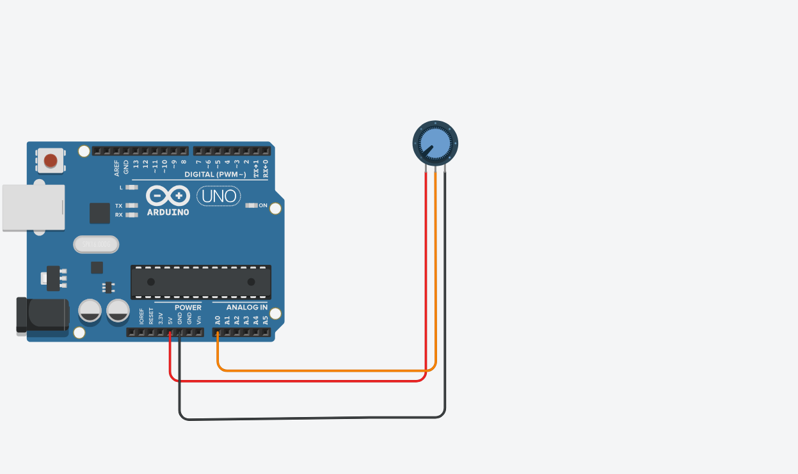

# PyPotDio
Python code to adjust your volume with Arduino and a potentiometer

You need to install "pynput" and "pyserial" library.
You can install with using pip. If you dont have pip you can install it. Follow the instructions below.

Open  CMD and write that code
```
py -m ensurepip --upgrade
```
This will install latest version of the pip or you can use Python installer for installing Pip.

For installing "pynput" library write that code into CMD.
```
pip install pynput
```
That will install last version of pynput

For installing "pyserial" library write that code into CMD.

```
pip install pyserial
```
That will install last version of pynput

| Items         | 
| ------------- |
| An Arduino board(I used UNO R3) capable of serial communication  | 
| Male to Male jumper wires(Minimum 3)| 
| A Breadboard to prototype easy    | 
| A potantiometer| 

Circuit is shown below(Made by Tinkercad)



You can plug middle terminal of pot into any anolog (A0,A1 etc.) pin you want. 